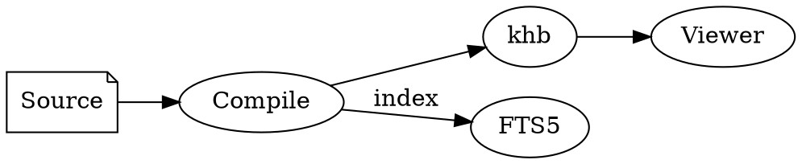

# Diagrams

A fenced ` ```dot ` (or ` ```graphviz `) block is laid out to an **SVG at build time** and
embedded straight into the page — the same approach as [math](math) (`$…$` → MathML). The
viewer runs no diagram engine, and the SVG is static and sandbox-safe (no scripts).

````md

````

Renders as:


The syntax is [Graphviz **DOT**](https://graphviz.org/doc/info/lang.html): `digraph { … }`
for directed graphs (arrows `->`), `graph { … }` for undirected (`--`). Node and edge
attributes like `shape`, `label`, and `rankdir` work; the graph is laid out by a
pure-Rust engine bundled into the compiler, so no Graphviz install is needed.

## Notes for KD Help Book

- **A DOT syntax error fails the build** — a broken diagram is caught at compile time, not
  shipped as a blank space (same policy as math).
- The engine covers the common flowchart / graph cases. Very large or exotic graphs may
  lay out less cleanly than desktop Graphviz.
- **Diagrams follow the viewer's colour theme.** A default (uncoloured) DOT diagram is
  emitted so its lines and labels take the page's text colour and its node fills take a
  themed surface — so it flips to light-on-dark automatically in the viewer's dark mode,
  no separate dark image needed. If you set an explicit **light** `fillcolor`, that fill
  is kept while the label text still follows the theme (the engine ignores `fontcolor`),
  so pick node colours that read against both a light and a dark background.
- **Mermaid** (` ```mermaid `) isn't supported: it's a JavaScript library that needs a
  headless browser to render, which would break the compiler's single-toolchain, offline
  build. DOT gives the same static-SVG result without that dependency.
- The SVG scales down to fit narrow screens and scrolls if it's wider than the page.
