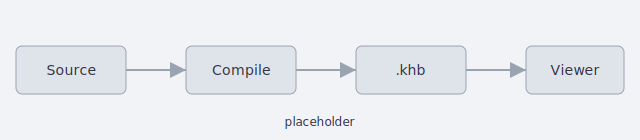

# Images & assets

Everything under the source folder's `assets/` directory (any depth) is stored in
the book and referenced by its **docset-relative `assets/…` path** — an image
renders inline, a link to any other file becomes a download. Use forward slashes
and keep files under `assets/`; other relative paths are left as plain links,
which won't resolve in the rendered page.

```md


Download the [quick-reference card](assets/quick-reference.txt).
```

## Images

Standard image syntax. An image renders inline, and the viewer offers a
**lightbox** (click to enlarge). Write meaningful `alt` text — it's what screen
readers announce and what search sees.

```md

```

> [!WARNING]
> Remote/absolute image URLs (`https://…`) are **not** fetched — content is
> origin-isolated and offline-first. Bundle images under `assets/` instead.

## Sizing

By default an image displays at its natural size, capped at the column width — a
full-resolution phone screenshot fills the whole page. Cap the *displayed* size
with a `#w=` hint on the path: pixels, or a percentage of the column.

```md


```

The hint never upscales a smaller image, still shrinks with narrow viewports, and
keeps the aspect ratio. It only affects display: the stored file is untouched and
the lightbox opens the full-size original.

## Downloads

A **link to a non-image asset** (`[label](assets/…)`) becomes a **download**. Every
file under `assets/` is stored whether or not a page references it, so a folder of
downloadable extras needs no inline mentions.

```md
Download the [quick-reference card](assets/quick-reference.txt).
```

## Embedded or sidecar

By default attachments are **embedded** in the `.khb`. Compile with
`--assets sidecar` to write them to a sibling **`.khba` pack** instead, keeping the
`.khb` itself lean — one docset can be backed by several packs, and a pack can be
fetched separately from (even later than) its book. See
[Compiling a book](compiling).

> [!TIP]
> Ship a big book lean: compile with `--assets sidecar`, publish the `.khb` and the
> `.khba` side by side, and readers who never open the appendix imagery never fetch
> it.

## How resolution works

At compile time an `assets/…` target is rewritten to the internal `asset:` scheme,
and the viewer resolves it — routed by the docset's `asset_index` straight to its
owning store, the embedded assets table or a specific `.khba` pack. If an asset's
pack isn't loaded, **Manage docsets** shows a "⚠ N missing assets" badge with an
*Add pack…* action.
