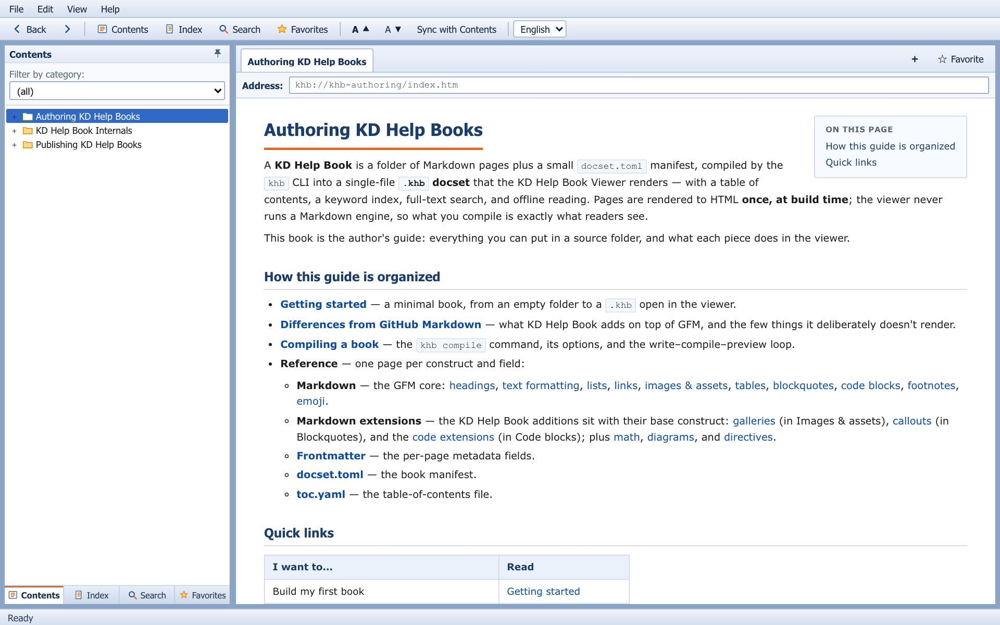
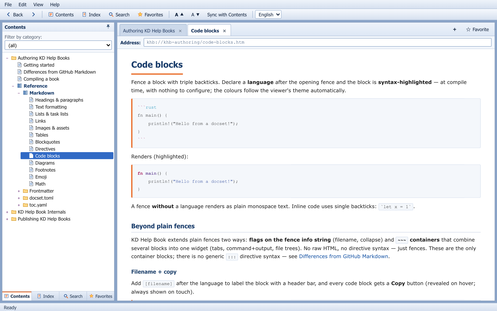
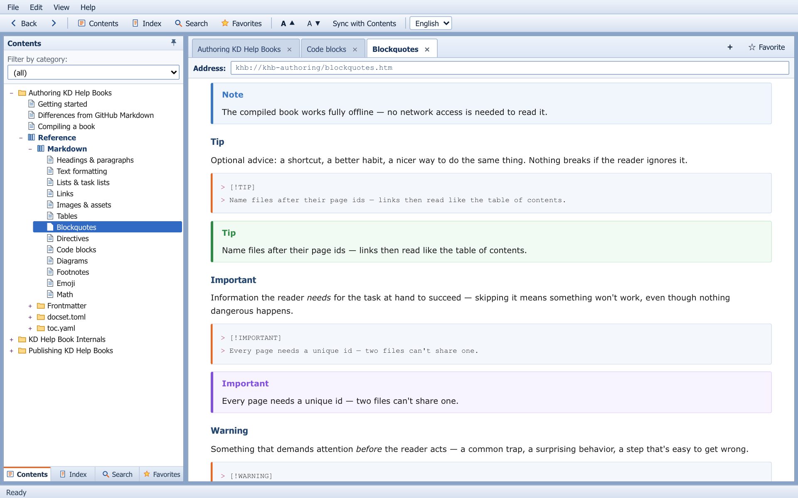

# Images & assets

Everything under the source folder's `assets/` directory (any depth) is stored in
the book and referenced by its **docset-relative `assets/…` path** — an image
renders inline, a link to any other file becomes a download. Use forward slashes
and keep files under `assets/`; other relative paths are left as plain links,
which won't resolve in the rendered page.

```md


Download the [quick-reference card](assets/quick-reference.txt).
```

## Images

Standard image syntax. An image renders inline, and the viewer offers a
**lightbox** (click to enlarge). Write meaningful `alt` text — it's what screen
readers announce and what search sees.

```md

```

> [!WARNING]
> Remote/absolute image URLs (`https://…`) are **not** fetched — content is
> origin-isolated and offline-first. Bundle images under `assets/` instead.

## Captions

Give an image a **title** — the quoted text after the URL — and it renders as a
`<figure>` with the title shown as a `<figcaption>` beneath it.

```md

```

## Sizing

By default an image displays at its natural size, capped at the column width — a
full-resolution phone screenshot fills the whole page. Cap the *displayed* size
with hints on the path: `#w=` takes pixels or a percentage of the column, `#h=`
takes pixels or a share of the reading pane (`vh`), and `&` combines them.

```md


```

A hint never upscales a smaller image, still shrinks with narrow viewports, and
keeps the aspect ratio (with both caps, the image fits inside the box). It only
affects display: the stored file is untouched and the lightbox opens the
full-size original.

## Galleries

A `~~~gallery` fence lays a set of images out as **uniform captioned tiles** — the natural
home for a step-by-step screenshot strip. Each image is one tile, its alt text is the
caption, and identical images all render at the same width (no cell-by-cell squeezing the
way a table of images gives you).

Here is a live gallery — three views of this very guide open in the viewer:

~~~gallery



~~~

Each `` on its own line starts a tile; the alt is shown as the caption
beneath the image. In source, a gallery is a `~~~gallery` fence:

    ~~~gallery
    
    
    
    ~~~

### Descriptions

Any text on the lines **after** an image — up to the next image or the closing fence —
becomes that tile's description, shown smaller and muted under the caption. Only inline
Markdown (bold, code, links) is used, and it wraps within the tile:

    ~~~gallery
    
    Tap the card — its **UID** appears.

    
    Exactly **one** tag may answer.
    ~~~

### Layout flags

Bare words in the fence info string tune the layout:

| Flag | Effect |
|------|--------|
| `w=<px>` | the shared tile width (e.g. `w=180`); defaults to a sensible width when omitted |
| `wrap` | **default** — tiles flow into more rows when the pane is narrow |
| `scroll` | keep a single row that scrolls sideways, preserving the step-strip order |

```md
~~~gallery w=180 scroll


~~~
```

Use `wrap` for a loose set of images that can reflow, and `scroll` for an ordered
sequence you want kept in one line. In print, a `scroll` gallery wraps so nothing is
clipped.

### Gallery notes

- **Clicking a tile** opens the full-size image in the lightbox, like any other image.
- **Captions are searchable** — the alt text feeds the page's plain-text index.
- A gallery with **no images** is a build error (the same rule the `~~~code-*` fences
  follow).

## Downloads

A **link to a non-image asset** (`[label](assets/…)`) becomes a **download**. Every
file under `assets/` is stored whether or not a page references it, so a folder of
downloadable extras needs no inline mentions.

```md
Download the [quick-reference card](assets/quick-reference.txt).
```

## Embedded or sidecar

By default attachments are **embedded** in the `.khb`. Compile with
`--assets sidecar` to write them to a sibling **`.khba` pack** instead, keeping the
`.khb` itself lean — one docset can be backed by several packs, and a pack can be
fetched separately from (even later than) its book. See
[Compiling a book](compiling).

> [!TIP]
> Ship a big book lean: compile with `--assets sidecar`, publish the `.khb` and the
> `.khba` side by side, and readers who never open the appendix imagery never fetch
> it.

## How resolution works

At compile time an `assets/…` target is rewritten to the internal `asset:` scheme,
and the viewer resolves it — routed by the docset's `asset_index` straight to its
owning store, the embedded assets table or a specific `.khba` pack. If an asset's
pack isn't loaded, **Manage docsets** shows a "⚠ N missing assets" badge with an
*Add pack…* action.
